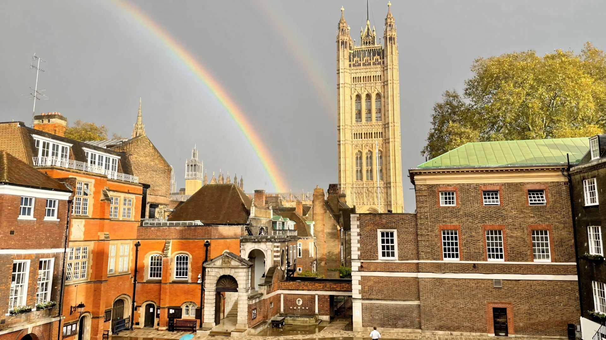

# Westminster School Public Profile

This repository serves as the public profile for Westminster School on GitHub. It aims to provide an accessible overview of the school's digital presence, projects, and contributions to the open-source community.

---

## About Westminster School

Westminster School is a historic independent school for boys and girls aged 7–18, located in the heart of London, England, adjacent to Westminster Abbey and the Houses of Parliament. With a rich history spanning over 450 years, the school is renowned for its academic excellence, vibrant intellectual life, and commitment to fostering independent thought and critical inquiry.

Founded in 1560 by Queen Elizabeth I, Westminster School has a long tradition of educating some of the most influential figures in British history, including numerous Prime Ministers, Nobel Laureates, and leading figures in the arts and sciences. The school maintains a strong emphasis on a broad and challenging curriculum, encouraging students to pursue their passions across a wide range of subjects, from the classical to the contemporary.

Beyond academics, Westminster School is known for its strong co-curricular program, encompassing a wide array of societies, sports, and creative arts. The school prides itself on its diverse and inclusive community, welcoming students from various backgrounds and fostering an environment where individuals can thrive and develop their unique talents.

In an increasingly digital world, Westminster School is committed to embracing technology as a tool for learning, innovation, and engagement. This public profile on GitHub is part of that commitment, providing a transparent look at how the school is interacting with and contributing to the digital landscape.

---

## Repository Contents

This repository will primarily contain:

* **General Information:** Links to the official Westminster School website and other relevant online presences.
* **Showcase of Projects:** Where applicable, links to public repositories of projects undertaken by students, staff, or school-affiliated groups that are deemed suitable for public viewing.
* **Contribution Guidelines:** Information on how external parties might engage with or contribute to any open-source initiatives from the school (if applicable).
* **Contact Information:** General contact details for public inquiries related to the school's digital activities.

---

## Contribution and Engagement

While this repository primarily serves as an informational hub, we welcome respectful engagement and inquiries. For specific questions related to school admissions or general school operations, please refer to the official Westminster School website.

For any technical inquiries or suggestions related to the content of this GitHub profile, please feel free to open an issue or contact us through the provided channels.

